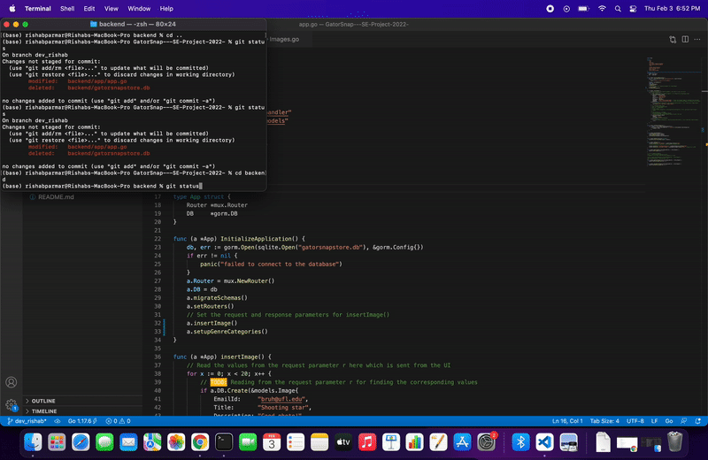

# GatorSnap 
### By: Pulin Soni, Rishab Parmar, Aakansh Togani, Sandesh Ramesh

## Sprint-1 Functionality

### Backend: 
- For Sprint 1, we started by creating the project structure and boilerplate code by following the industry standards. We then proceeded forward to design and create the database schemas for the features planned for Sprint 1.   

- Moreover, we then fed dummy data to these databases that will mimic the original data that will be received with the front end. We then created the following APIs:

- /fetchImages: API to fetch all the images(product catalogs) and corresponding data from the SQLite database.
Method: GET
- /fetchGenreCategories: API to fetch all the various genres available from the database to display for seller upload page

- These APIs when called from the front end will help the data to be delivered to the UI when requested. Furthermore, we have partially worked on the /uploadSellerImage API which is a POST method-based API. This API will take the input from the seller upload form and upload the data in our database through this API. Moreover, the code to upload the image to the cloud storage has been coded but is yet to be tested.

- Worked on Marshalling and UnMarshalling of JSON data.

- Developed several data structs to store data in sqlite.

### Video Walkthrough

Here is a walkthrough of what was achieved on the backend and database side for sprint 1.
